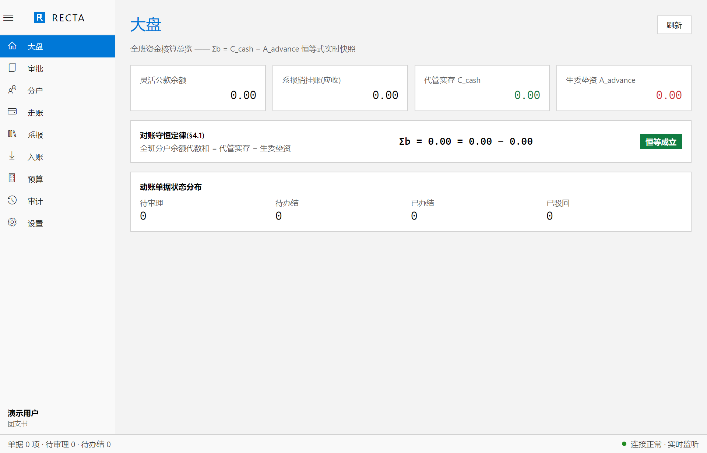
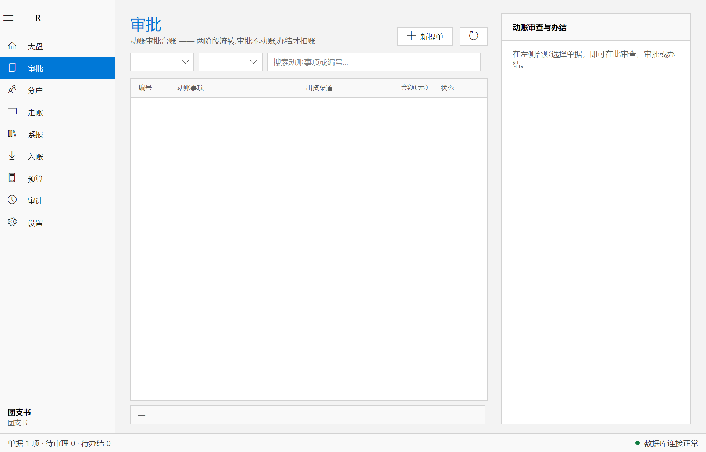
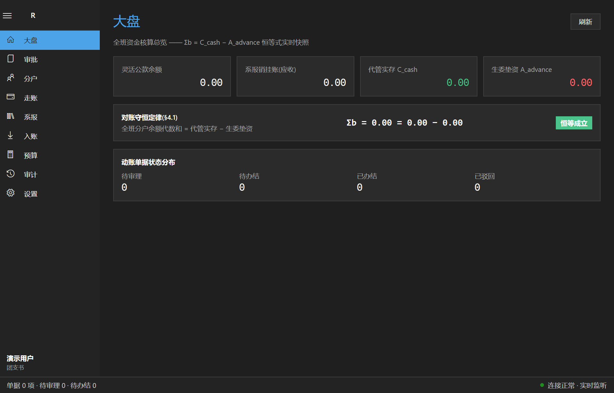
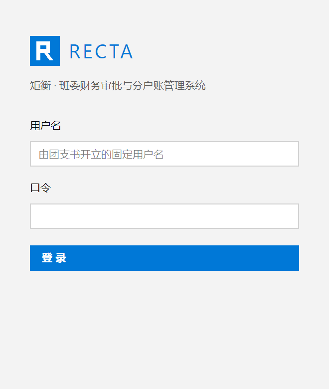

# Recta 矩衡

**高校班委财务审批与分户账管理系统** —— 高确定性、强一致性、严禁模糊账目。

<p align="center">
  
  &nbsp;
  
</p>
<p align="center">
  
  
  &nbsp;
  
</p>

- **三类异构资金通道**：班级灵活走账公款（团支书存管）· 系级报销往来暂挂（生活委员存管）· 班费纯个人独立分户（受托代管，无公共资金池）
- **两阶段流转**：审批（资质与额度认定，不动账）→ 办结（资金到位确认，原子事务扣账）
- **点对点借贷实质**：透支记负，构成向生活委员个人的无息借贷；办结批复自动披露垫资明细
- **全链路整数分**：`int64_t` 定点 `Money`，全局禁用浮点；尾差保全平摊 + 对账守恒不变式（Σb = C_cash − A_advance）
- **实时同步**：`change_events` 全局单调序列增量拉取 + `NOTIFY` 轻通知双轨；断线退避重连、重连即补齐收敛

## 技术栈

| 层 | 技术 |
| --- | --- |
| 前端 | Avalonia UI 11（.NET 10，C#），Win10 UWP / MDL2 视觉：绝对方角、1px 实体细线、高信息密度、等宽表格数字、明暗双主题（`#0078D7` 七级蓝色阶） |
| 核心业务 | Modern C++20（MSVC），`Recta.Domain`（纯计算）→ `Recta.Storage`（pqxx）→ `Recta.Core`（服务层）→ `Recta.CApi`（C ABI DLL） |
| 数据库 | Neon Serverless PostgreSQL（金额一律 `BIGINT` 分；`FOR UPDATE` 行级锁；抗休眠重试执行器；监听走非池化端点） |
| 互操作 | C ABI `recta_capi.dll`（错误码 + JSON 载荷）↔ C# `LibraryImport` P/Invoke |

**严禁** WebView / 浏览器内核 / Electron / Tauri / WebView2。

## 仓库导览

| 路径 | 内容 |
| --- | --- |
| [Vibe.md](Vibe.md) | 最高技术规范与业务上下文（唯一真理基准） |
| [VibeState.md](VibeState.md) | Phase 规划（P0–P13）、进度与工程决策记录 |
| `native/` | C++20 核心：领域内核 / 存储 / 服务 / C ABI |
| `desktop/` | Avalonia 前端：Recta.App / NativeInterop / 测试 |
| `db/schema/001_init.sql` | 数据库初始化 DDL（版本化） |
| [`docs/使用指南.md`](docs/使用指南.md) | 使用指南：安装、各模块操作、测试库、常见问题 |
| `docs/images/` | 界面截图 |

## 构建与运行（Windows）

前置：Visual Studio 2022 C++ 工具集 · CMake 3.24+ · vcpkg（设 `VCPKG_ROOT`）· .NET SDK 10 · Neon PostgreSQL（连接串见下）。

```bash
git clone https://github.com/Furina-1314/Recta.git
cd Recta

# 1) 原生核心(首构需编译 openssl/libpq/pqxx 等,约 10~20 分钟)
VCPKG_ROOT=<你的vcpkg> cmake --preset win-x64-release -S native -B native/build/win-x64-release
VCPKG_ROOT=<你的vcpkg> cmake --build native/build/win-x64-release --config Release
ctest --test-dir native/build/win-x64-release -C Release --output-on-failure   # 领域/存储/服务 3 套

# 2) 桌面(构建时会自动把 recta_capi.dll 带入输出)
cd desktop
dotnet build Recta.slnx -c Release
dotnet test Recta.slnx -c Release      # 互操作/工作流/同步 6 项(真库)

# 3) 运行
dotnet run --project Recta.App -c Release
```

**数据库连接**：在仓库根放 `.env.local`（已 gitignore，绝不入库）：

```
DATABASE_URL="postgresql://...@ep-xxx-pooler.../neondb?sslmode=require"
DATABASE_URL_UNPOOLED="postgresql://...@ep-xxx.../neondb?sslmode=require"   # 可选,监听通道用(无则自动剥 -pooler 派生)
```

初始化 DDL 见 `db/schema/001_init.sql`。集成测试另用 `RECTA_TEST_DATABASE_URL` 或 `.env.test.local` 指向隔离测试分支（推荐用 Neon 分支复制 schema）。

**首次运行**：空系统会弹出一次性引导——开立首任团支书并生成临时口令，首登强制改密；其后所有账号由团支书在系统内开立。

## 测试与数据库隔离

生产数据零污染是硬约束，所有测试流量都走 Neon 的 `recta-test` 分支（schema 复制自 production，物理隔离，写坏随时重置）：

| 场景 | 方法 | 碰到的库 |
| --- | --- | --- |
| **自动化回归**（48 项 C++ + 17 项 C#，覆盖领域算法/存储/认证/两阶段流转/导出/同步收敛） | `ctest --test-dir native/build/win-x64-release -C Release` 与 `dotnet test desktop/Recta.slnx -c Release` | 仅 recta-test（测试内自动清库重建数据） |
| **GUI 手工试玩**（点界面、造数据、验流程） | 双击 `scripts\launch-test.bat`（可传参指定 exe 路径，自动优先已安装位置） | 仅 recta-test |
| **正式使用** | 双击桌面或安装目录的 Recta 矩衡（读 `.env.local`） | 仅 production |

**窗口标识（防混淆）**：`launch-test.bat` 启动的实例，窗口标题固定带**【测试库】**字样；正常启动的生产实例无此标记。测试实例带硬保护——即使配置缺失也只会启动失败，绝不可能静默连上生产库。

**测试库生命周期须知**：

- 每次跑自动化测试，测试库会被清空并重建**测试自己的账号**（如 `sync_sec`），因此测试后手动登录请先重置（见下），或使用测试代码中已知的账号口令
- **重置测试数据**：Neon Console → `recta-test` 分支 → Reset from parent（秒级回滚到干净 schema）；或在 SQL Editor 执行 [`db/reset-test.sql`](db/reset-test.sql) → 重置后 bat 启动的实例会重新出现首任引导面板
- 测试分支连接串放仓库根 `.env.test.local`（gitignored）：`DATABASE_URL="postgresql://…recta-test分支的-pooler端点…"`
- 跑自动化测试前，原生核心须为开发构建（`RECTA_DEV_TOOLS=ON`，仓库默认）；发布打包前按下一节切回 `OFF`
- 生产分支自始至终只承载真实数据；若怀疑被污染，可比对 `users`/`expense_requests` 行数

## 日常操作要点

- **窗口标识**：标题带【测试库】= 测试实例（数据随便造）；无标记 = 生产实例
- **账号自保护**：团支书不可停用自己的账号、不可重置自己的密码（防自锁，须走验旧口令的改密流程）；团支书与生活委员席位各仅一人在任；账号只有停用没有删除
- **权限可见性**：账目 / 分户对团支书与生活委员可见（生活委员仅班费类流水）；审计 / 用户仅团支书
- **驳回**：必选预置原因（票据凭证不全 / 金额有误 / 不属于班级支出 / 超出预算额度 / 信息填写不完整 / 重复提单 / 其他），选"其他"须填补充说明；驳回为终态，需重新提单
- **单号**：支出单 `REQ-NNNNNN`、入账 `INF-NNNNNN`，全局唯一，可用于搜索与关联
- **导出**：账目页导出筛选后的流水、分户页导出名单余额、分户详情导出个人流水——CSV（UTF-8 带 BOM，Excel 直开）
- **崩溃日志**：`%LOCALAPPDATA%\Recta\logs\crash.log`（如遇异常退出，请提供此文件）

## 发布打包

```bash
# 发布构建:关闭开发工具(去掉 recta_dev_truncate_all),重建 DLL
VCPKG_ROOT=<你的vcpkg> cmake -DRECTA_DEV_TOOLS=OFF native/build/win-x64-release
VCPKG_ROOT=<你的vcpkg> cmake --build native/build/win-x64-release --config Release --target recta_capi

# 自包含发布(无需目标机安装 .NET)
cd desktop
dotnet publish Recta.App -c Release -r win-x64 --self-contained -o ../artifacts/Recta-0.3.0-win-x64
```

产物为绿色文件夹分发：`Recta.App.exe` + `recta_capi.dll`（原生核心）+ 自包含运行时，连同 `.env.local` 一并放置即可运行。

**冒烟自检**（可选）：`RECTA_SMOKE=1` 跳过登录直入主窗并输出明/暗两张截图后自动退出；支持 `RECTA_SMOKE_PAGE=<nav-tag>`、`RECTA_SMOKE_TESTDB=1`、`RECTA_SMOKE_LOGIN=1`、`RECTA_SMOKE_ROLE/USER` 定制走查。

## 版本管理

GitHub：<https://github.com/Furina-1314/Recta>，以 Phase 为断点提交，进度见 [VibeState.md](VibeState.md)。
